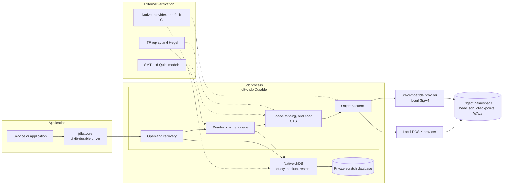
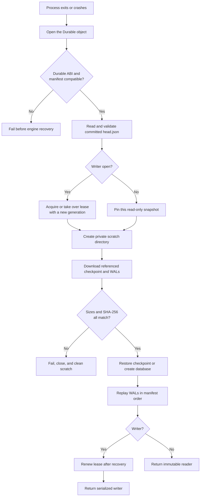
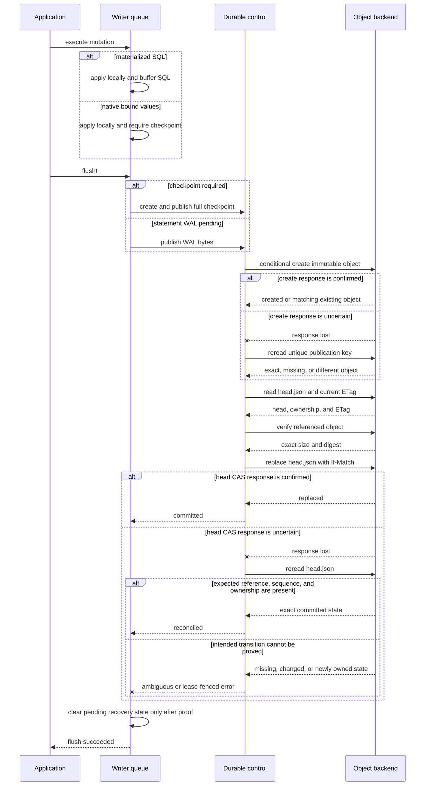

# Durable storage

Durable mode is an experimental persistence layer for embedded chDB. It stores
immutable database checkpoints and statement write-ahead logs (WALs) outside
the process. A small manifest named `head.json` says which objects make up the
current database.

This guide explains when to use Durable, how to configure it, what happens at
each persistence boundary, and what the current tests and models do and do not
establish. The [README](../README.md#durable-storage-experimental) remains the
short setup path.

## Current status

Implemented today:

- public Durable reader and writer handles through the `chdb-durable` JDBC
  driver;
- strict parsing and compatibility checks for the V1 `head.json` format;
- a single-writer lease with generation fencing, heartbeat renewal, takeover,
  and release;
- buffered statement WALs, explicit flush, full checkpoints, and verified
  checkpoint/WAL recovery;
- a process-safe local POSIX backend and an S3-compatible backend using native
  libcurl SigV4; and
- bounded formal models, model-generated implementation traces, Hegel property
  tests, deterministic fault injection, and focused CI lanes.

Important limits:

- The normal installer pins stable chDB 26.7.0, which does not export the
  Durable ABI. Durable use currently requires the separately qualified
  26.7.2-rc.2 library.
- Hosted native qualification currently runs on Linux x86-64. Release assets
  are pinned for Linux arm64 and macOS, but those mappings are not evidence of
  equivalent hosted qualification.
- The local backend is for private local storage shared by cooperating Jolt
  processes. It is not qualified for NFS, SMB, or external writers.
- The S3 path is checked against a semantic transport, a loopback libcurl
  server, pinned MinIO, and an environment-protected live AWS OIDC lane.
  The loopback path also has bounded-memory 32/64/128 MiB checkpoint evidence.
  Additional injected real-transport timeout boundaries and more corruption
  cases remain work in progress.
- WAL records contain complete SQL strings. Parameterized mutations are
  supported through full-checkpoint fallback; streaming inserts remain outside
  the Durable writer contract. Reads also support bound parameters.
- A reader sees the immutable manifest snapshot it opened. It does not follow
  later writer commits.

These limits make Durable useful for development, qualification, and controlled
single-host trials. They also mean it should not yet be presented as a broadly
qualified production durability layer.

## How the pieces fit

The application uses the ordinary JDBC boundary. Durable owns recovery and the
serialized reader/writer lifecycle, calls the native chDB ABI for database work,
and uses one backend interface for local or remote objects. The formal models
and test tools are external checks on those seams; they are not part of a
production request.



The arrows from verification tools mean “checks this boundary,” not runtime
calls. The same `ObjectBackend` contract keeps the lease and manifest code
independent of the selected provider.

## Enabling Durable

First qualify the checksum-pinned chDB 26.7.2-rc.2 asset and select it. On
Linux x86-64:

```sh
bash scripts/qualify-durable-native.sh /tmp/jolt-chdb-durable
export JOLT_CHDB_LIB=/tmp/jolt-chdb-durable/native/libchdb.so
```

The script also runs the pinned upstream C ABI oracle and Jolt's independent
classification, backup, restore, WAL recovery, and checkpoint recovery checks.
Use `libchdb.dylib` instead on macOS. Do not replace the normal stable pin with
this prerelease without doing the same qualification in your deployment.

### Local writer

```clojure
(require '[jdbc.chdb.durable :as durable]
         '[jdbc.chdb.durable.local-posix :as durable-local]
         '[jdbc.core :as jdbc])

(def durable-namespace
  (durable-local/local-backend "/var/lib/my-app/chdb-objects"))

(with-open [conn (jdbc/connection
                  (durable/writer-dbspec
                   {:namespace-backend durable-namespace
                    :object-id "primary"
                    :owner "my-app"
                    :database "default"
                    :lease-ttl-ms 30000}))]
  (jdbc/execute! conn "CREATE TABLE IF NOT EXISTS events
                       (id UInt64, message String) ENGINE = MergeTree
                       ORDER BY id")
  (jdbc/execute! conn "INSERT INTO events VALUES (1, 'accepted')")
  (durable/flush! conn))
```

The namespace root should be private. A newly created root and its object
directories use mode `0700`; object and staging files use `0600`. The provider
uses a kernel lock, atomic same-directory rename, file synchronization, and
directory synchronization before it reports a successful publication.

### Read-only snapshot

```clojure
(with-open [conn (jdbc/connection
                  (durable/snapshot-dbspec
                   {:namespace-backend durable-namespace
                    :object-id "primary"}))]
  (jdbc/fetch conn "SELECT * FROM events ORDER BY id"))
```

A reader does not acquire a lease and cannot call `flush!` or `checkpoint!`.
It downloads and verifies exactly the manifest snapshot observed at open. The
same map can be passed to `jdbc/connection` in another process; it needs no
writer owner, instance, database, lease, heartbeat, or force option.

Both constructors return ordinary maps accepted by `jdbc.core`. They validate
the complete option set before any provider request or native open. A writer
gets a fresh UUIDv4 `:instance` when none is supplied; this identity is opaque,
while the monotonically increasing lease generation remains the protocol's
ordering and fencing authority.
Integrations can call `durable/connection-role` before performing any writes;
it returns `:writer` or `:reader` without publishing state, and rejects ordinary
chDB connections.

### S3-compatible namespace

Compiled Jolt applications should construct the native transport explicitly so
the AOT build retains its FFI bindings:

```clojure
(require '[jdbc.chdb.durable.s3-curl :as durable-s3])

(def durable-namespace
  (durable-s3/s3-backend
   {:endpoint "https://object-store.example"
    :bucket "my-durable-bucket"
    :prefix "chdb"
    :region "us-east-1"
    :access-key (System/getenv "AWS_ACCESS_KEY_ID")
    :secret-key (System/getenv "AWS_SECRET_ACCESS_KEY")
    :session-token (System/getenv "AWS_SESSION_TOKEN")}))
```

Pass this value as `:namespace-backend` in the writer or reader examples. The
backend uses path-style URLs, `If-None-Match: *` for immutable objects, and the
opaque current ETag in `If-Match` for `head.json`. It needs object read and
conditional-write permission below the configured prefix. It does not list or
delete objects. Credentials are kept out of object keys, manifests, WALs,
traces, and public errors.

This configuration shape is implemented, but the repository's merged CI does
not yet make a real-AWS provider claim. Treat it as an S3-compatible evaluation
path until your provider and failure boundaries have been qualified.

### Configuration reference

| Option | Meaning |
| --- | --- |
| `:namespace-backend` + `:object-id` | Recommended pair passed to `writer-dbspec` or `snapshot-dbspec`. The backend is shared; the object ID selects one database below it. |
| `:backend` | Advanced JDBC option for an already object-scoped backend. Do not combine it with the namespace/object pair. |
| `:owner` | Nonblank writer identity, usually an application or service name. Required for writers. |
| `:instance` | Nonblank identity for one process or writer attempt. `writer-dbspec` defaults it to a fresh UUIDv4; an explicitly supplied value must be unique per attempt. |
| `:database` | Logical database to create for a new Durable object. An existing object's manifest remains authoritative. |
| `:read-only?` | When true, open one immutable snapshot without a writer lease. |
| `:lease-ttl-ms` | Writer lease lifetime; defaults to 30 seconds. |
| `:heartbeat-interval-ms` | Renewal interval; defaults to one third of the TTL and may not exceed that bound. |
| `:clock-skew-ms` | Extra time before normal expired-lease takeover; defaults to zero. |
| `:max-attempts` | Maximum control-plane attempts within one operation; defaults to four. |
| `:retry-deadline-ms` | Monotonic budget shared by attempts, backoff, and ambiguity proof reads; defaults to 5 seconds. |
| `:retry-initial-backoff-ms` | First retry delay; defaults to 10 milliseconds. |
| `:retry-max-backoff-ms` | Cap for exponential retry delay; defaults to 250 milliseconds. |
| `:scratch-parent` | Parent for private recovery directories; defaults to the process temporary directory. For Linux S3 recovery, the default assumes normal sticky-temp protection; a custom parent must prevent other OS principals from renaming or replacing its private scratch child. |
| `:force?` | Allow explicit takeover before lease expiry. Use only with external knowledge that the old writer must be fenced. |

The `*-ms` names above describe the application configuration and remain in
milliseconds. On `head.json`, Protocol V1 freezes `lease.expires_at` as Unix
epoch seconds. jolt-chdb converts at that boundary and preserves millisecond
fractions; retry deadlines continue to use the monotonic millisecond clock and
are never serialized.

### Migrating heads written by older jolt-chdb builds

Older development builds wrote epoch milliseconds into `expires_at`. The V1
reader deliberately does not guess a unit from numeric magnitude: doing so
would make two writers interpret the same frozen field differently. Stop every
old writer first. Then open once with `:force? true`; the takeover increments
the fencing generation and rewrites the active lease in epoch seconds. Do not
run old and corrected writers together. Mixed-unit writers are unsupported and
unsafe.

## Persistence and recovery

The manifest contains the database name, an optional checkpoint reference, an
ordered WAL list, a manifest sequence number, and the current lease. Checkpoint
and WAL objects are immutable. Only `head.json` changes in place, and every
change is conditional on the exact ETag that the writer just read. Retries use
a monotonic deadline and capped exponential backoff. An uncertain write is
never sent again: only the read that proves its outcome may repeat. If the
locally known lease expires during a wait, the writer self-fences before
another storage attempt and retains any uncommitted recovery work.

Opening a writer follows this order:

1. Check that the selected native library has the Durable ABI and can read the
   manifest's engine version and backup format.
2. Acquire a missing, released, or expired lease. Each takeover increments its
   generation.
3. Create private scratch storage, restore the checkpoint if present, replay
   WAL statements in manifest order, select the logical database, and renew the
   lease again before returning the writer.
4. Run serialized database operations on a bounded queue and an owned OS thread
   while a second owned OS thread renews the lease. Native work therefore
   cannot pin a shared Jolt fiber carrier and starve heartbeat renewal.

After a crash, recovery trusts only objects named by the committed head. It
downloads into private scratch paths, verifies every size and SHA-256 digest,
then restores the checkpoint and replays WAL statements in manifest order.



An upload that was never committed into `head.json` is unreachable and is not
replayed. A writer is not returned until recovery finishes and its lease is
renewed; a reader never changes lease state.

Every mutation and flush checks locally known lease expiry before it changes
state. Every manifest update rereads ownership and requires the same owner,
instance, and generation. Once that read shows an older generation, the writer
is fenced before reference verification or head mutation. A takeover racing an
already-started immutable upload can leave an unreferenced object, but cannot
make the new generation's head refer to it.

### When a write is acknowledged

`execute!` changes the recovered local engine. A fully materialized mutation
appends its complete SQL statement to an in-process WAL buffer. A mutation with
bound values instead marks the writer checkpoint-required because frozen V1
WAL has no typed-parameter record. Neither result alone is a persistence
acknowledgement.

`flush!` serializes and publishes pending statements as a new immutable WAL
when all mutations are materialized. If any successful bound mutation is
pending, it publishes a full checkpoint that also covers any pending statement
WAL. It then conditionally advances `head.json` and returns successfully only
after the update is confirmed or an uncertain response is reconciled by
rereading the exact expected reference and sequence. The implementation keeps
both pending recovery obligations if that outcome cannot be proved.

`checkpoint!` creates a full native backup, streams and verifies its immutable
publication, and then conditionally replaces the checkpoint reference while
clearing covered WALs. A successful close drains queued work, flushes pending
statements, releases the lease, closes chDB, removes scratch storage, and
positively joins the owned operation OS thread before returning. Reader close
has the same worker-join boundary after native close and scratch cleanup. Thus
a returned or rethrown public close proves that its operation thread is no
longer live, not only that the worker published a terminal result.

Applications that acknowledge an external request should therefore call and
successfully return from `flush!` (or `checkpoint!`) first. A crash before that
boundary can lose the in-process WAL buffer. A crash after an immutable object
upload but before its manifest commit may leave an unreachable object, but
recovery ignores anything not referenced by the committed head.

The acknowledgement path has two conditional publications. First the selected
WAL or checkpoint object must exist with the exact expected bytes. Then
`head.json` must point to that reference at the next sequence. A lost provider
response is reconciled by rereading state; it is never treated as proof of
failure or success by itself.



Error branches stop before “flush succeeded.” On an unprovable result the WAL
buffer and checkpoint-required marker remain available to the writer, while
changed ownership permanently fences it.

## Storage and lease safety

The storage interface has six operations: read bytes, read bytes with ETag,
create immutable bytes, create an immutable file, replace bytes if the ETag
matches, and stream an object into a new file. Providers must implement atomic
conditional create and replace. A `HEAD` followed by an unconditional `PUT` is
not sufficient.

Network writes can finish at the provider even when the client loses the
response. Such writes are `ambiguous`, not failed. The control plane rereads the
unique immutable key or `head.json` and accepts success only when the exact
operation-specific state is present. Changed ownership fences the writer;
retained ownership without the intended transition remains an explicit
`commit-ambiguous` error.

The detailed contracts are:

- [ABI provenance](durable-abi.md)
- [`head.json` format and validation](durable-head.md)
- [backend and local POSIX semantics](durable-backend.md)
- [lease and head-CAS control](durable-control.md)
- [writer queue and WAL behavior](durable-writer.md)
- [open, recovery, and reader behavior](durable-open.md)
- [S3-compatible provider](durable-s3.md)

The public composition is in
[`src/jdbc/chdb/durable.clj`](../src/jdbc/chdb/durable.clj). The serialized
worker is in
[`src/jdbc/chdb/durable/writer.clj`](../src/jdbc/chdb/durable/writer.clj), the
lease and manifest transitions are in
[`src/jdbc/chdb/durable/control.clj`](../src/jdbc/chdb/durable/control.clj), and
the providers live below
[`src/jdbc/chdb/durable/`](../src/jdbc/chdb/durable/).

## How the model and tests fit together

The tests deliberately make different claims. No one layer is described as a
complete proof of the running application.

### SMT and Quint models

The small SMT models in `formal/durable-backend-*.smt2` check that an atomic
backend CAS cannot give two writers success from the same starting revision.
The head-CAS SMT models check the stale-writer safety boundary. Each corrected
model has a deliberately broken mutant that must produce a counterexample, plus
a reachable valid boundary so an accidentally impossible model cannot pass
vacuously.

[`formal/quint/durable-head-cas.md`](../formal/quint/durable-head-cas.md) is the
authoritative executable literate model. The build tangles Quint code from its
Markdown fences, then typechecks, runs deterministic examples, samples traces,
and uses Apalache for bounded verification through six transitions. It models
two writers and exact publication attempts, generation, sequence, ownership,
ambiguous head updates, renewal during reconciliation, and release. It does not
model real clocks, retry timing, JSON/ETag encoding, scratch files, native
restore, process lifecycle, or liveness.

The model carries two transition monitors. One requires the full
attempt-bearing publication reference; the other erases the attempt identity
and checks the remaining object, generation, and sequence. Commit validity also
projects the committed reference to object content, but the current model does
not claim a second transition-level refinement down to a content-only state.
Mutants for stale ownership, wrong generation or sequence, reused publication
attempts, unpublished attempts, and whole-head reconciliation must each fail.

[`formal/quint/durable-writer-lifecycle.md`](../formal/quint/durable-writer-lifecycle.md)
is a separate small lifecycle model so the existing head/ITF state projection
does not change. It checks that heartbeat covers admitted-close drain and
flush, that release follows a positive heartbeat termination handshake, and
that renewal cannot follow release. Its stopped-at-close-admission mutant must
expose the prior lease-expiry counterexample.

### Model-based traces and Hegel

Quint emits traces in ADR-015 ITF form. The
[`chdb_durable_itf_test`](../test/jdbc/chdb_durable_itf_test.clj) decodes the
command metadata, executes the same operations against the in-memory backend,
and compares the implementation's abstract head and result with every complete
ITF state. The CI corpus replays 64 generated traces, rather than only one
handpicked scenario. Its deterministic seed must cover every legacy action and
every modeled control outcome, including confirmed and reconciled commits,
ambiguous failure, stale fencing, object rejection, and accepted/rejected
release. The gate writes the aggregate counts to
`target/formal/quint/itf-corpus-coverage.json` before replay.

Hegel checks properties in the focused
[head](../test/jdbc/chdb_durable_head_test.clj),
[backend](../test/jdbc/chdb_durable_backend_test.clj),
[control](../test/jdbc/chdb_durable_control_test.clj), and
[writer](../test/jdbc/chdb_durable_writer_test.clj) suites. They cover unknown
field preservation, stale ETags, and generated operation sequences across the
lease, manifest, queue, and WAL models. The ITF replay also validates the
versioned `hegel.operation-events` envelope: contiguous events, one terminal
result per invocation, parentage, causality, and context.

An ITF replay or an observed application trace validates one execution. It is
not model checking. Unconstrained bounded verification still explores modeled
behaviors that a test run may never observe.

### Trace instrumentation

The sibling `jolt-aspect-packs` project can observe the semantic control calls
without changing this library. It records bounded, privacy-shaped commands and
outcomes, then validates the complete journal offline. Advice is intentionally
observation-only and fail-open; assertions belong in the ordinary test after
the journal is complete. A plain, non-woven lane remains necessary.

Use the semantic publication functions as join points. A low-level backend
`PUT` lacks writer and generation context and is not enough to determine that a
Durable publication happened. See [Durable trace validation](durable-trace-validation.md)
for the shared command vocabulary and evidence ordering.

### Fault injection and CI

Deterministic tests inject both outcomes around the key uncertainty boundary:
the provider may apply a conditional object create or head replacement and lose
the response, or it may drop the write. They also exercise stale ownership,
conflicting immutable objects, malformed manifests and WALs, partial downloads,
short writes, interrupted system calls, concurrent local CAS, and a process
killed while holding the local provider lock.

Current CI separates the claims:

- [`tests`](../.github/workflows/tests.yml) runs the full Jolt suite, Hegel
  properties, an isolated one-carrier worker/heartbeat regression, the local
  POSIX process checks, and the loopback libcurl gate on Linux;
- [`durable-s3-qualification`](../.github/workflows/durable-s3.yml) adds the
  semantic S3 suite, bounded-memory large-checkpoint gate, and pinned MinIO;
- [`durable-native-qualification`](../.github/workflows/durable-native.yml)
  runs the upstream C oracle and the Jolt native ABI, classification,
  backup/restore, and local WAL/checkpoint recovery suite against chDB
  26.7.2-rc.2 on Linux x86-64; and
- [`durable-head-quint`](../.github/workflows/durable-head-quint.yml) tangles
  the literate spec, replays the ITF corpus, and runs deterministic, sampled,
  bounded corrected, and mutation-control checks; and
- [`durable-aws`](../.github/workflows/durable-aws.yml) is a manual,
  environment-protected GitHub OIDC lane for the shared provider suite against
  a pre-provisioned AWS S3 prefix. It uses no long-lived credentials; exact-main
  [run 34202755181](https://github.com/chucklehead-dev/jolt-chdb/actions/runs/34202755181)
  passed the live provider suite.

The next confidence-building work is a larger process-crash and corruption
matrix around flush/checkpoint cuts, injected real-transport failures, and the
remaining native platform runners. Those are
pending tests and qualifications, not hidden features of the current
implementation.

## Development commands

The commands below assume `jolt` selects Jolt v0.8.3 with Chez 10.4.1. In the
shared `ai-src` maintainer workspace, run them through the pinned wrapper named
in the parent `AGENTS.md`; external checkouts should provide the same versions
through their own toolchain setup.

```sh
jolt -M:durable-open-test
bash test/durable-s3-minio.sh jolt
scripts/check-durable-head-itf-corpus.sh
scripts/check-durable-head-quint.sh --verify
```

The full list of focused aliases is in the README's
[Development](../README.md#development) section.
