# Native process lifecycle

chDB embeds one process-global engine. `jolt-chdb` keeps that engine alive from
the first successful open across every logical last close by retaining a
private anchor connection. Closing an application connection closes that
connection, but not the anchor. At orderly process exit, a driver-owned
shutdown hook claims and closes the anchor exactly once before host native
teardown. The first physical path is therefore immutable for the process.
Path identity is canonical: lexical `.`/`..` aliases and existing symlink
prefixes resolve before the claim is compared.

The C owner is a raw FFI pointer, not a host-managed object with a native
finalizer. Retaining it in process state preserves ownership but does not
release it; the explicit hook is therefore part of the ownership contract.

This policy is deliberately stricter than the chDB C API and is not part of
Durable V1. The pinned 26.7.3
[`chdb.h`](https://github.com/chdb-io/chdb-core/blob/7d84d719da07184f6a49405a11b112f16925af72/programs/local/chdb.h)
permits a different path after every connection closes, but also says to keep
one connection for the host lifetime and warns that repeated
last-close/reinitialize cycles can corrupt the allocator on macOS. The
implementation follows the conservative host guidance. Upstream's
[`EmbeddedServer.cpp`](https://github.com/chdb-io/chdb-core/blob/7d84d719da07184f6a49405a11b112f16925af72/programs/local/EmbeddedServer.cpp)
is the source oracle for reference counting, irreversible shutdown, and path
selection.

## Policy choice

| Candidate | Consequence | Decision |
| --- | --- | --- |
| process anchor and immutable path | same-path handles may reopen; another physical path requires another process | chosen; one safe behavior on supported hosts |
| `chdb_shutdown()` at logical last close | clean terminal shutdown, but every later open in that process must fail | not chosen; unnecessarily prevents same-path reuse |
| allow Linux reinitialize, reject it on macOS | preserves more Linux behavior, but gives applications platform-dependent lifecycle semantics | not chosen; harder to reason about and test portably |

The anchor is created and fully validated before the first public connection
is returned. Failures before entering `chdb_connect` and its documented null
owner return leave the process unclaimed and are safe to retry. Any other
exception after entering the native bootstrap has uncertain engine ownership
and makes the lifecycle terminal. A non-null owner that cannot yield a valid
inner connection is closed best-effort before that transition; retrying could
otherwise cross the unsafe last-close boundary. Once an anchor exists, failure
to create a public connection leaves the anchor and path claim intact so a
same-path retry is safe.

Bootstrap options are part of the claim. Reopening the same physical path with
a different `:backups-allowed-path` is rejected instead of pretending that the
already-running engine adopted a new global configuration.

```mermaid
stateDiagram-v2
  [*] --> Cold
  Cold --> Anchored: validate anchor owner and inner connection
  Cold --> Cold: pre-native failure or null owner; reject open
  Cold --> Terminal: uncertain post-entry failure
  Anchored --> Anchored: open/close public same-path handles
  Anchored --> Anchored: reject different path before native connect
  Anchored --> Exiting: process hook claims anchor
  Exiting --> ExitClosed: process hook closes anchor once
  ExitClosed --> ExitClosed: reject every new open
  Terminal --> Terminal: reject every open
```

At exact Jolt revision
[`2d39e854`](https://github.com/casselc/jolt/blob/2d39e854a90926d8f8e9bd5d3ddbb109d657afe1/host/chez/java/concurrency.ss#L2803-L2862),
shutdown registration prepends each hook, the once-only runner reverses that
snapshot, and one `for-each` invokes each hook body directly on the shutdown
thread. Hooks therefore run sequentially in registration order, rather than
with the JVM's concurrent/unspecified ordering. The ordinary-return path calls
that runner after user threads finish and before host teardown in
[`cli-core.ss`](https://github.com/casselc/jolt/blob/2d39e854a90926d8f8e9bd5d3ddbb109d657afe1/host/chez/cli-core.ss#L395-L421).

The anchor hook serializes its native close with public-owner closes, while
ordinary query and export operations retain their existing path and throughput.
The process-exit regression uses a later observer hook to prove that typed
ClickHouse export/readback, checkpoint, and explicit application close all
complete before the anchor reaches `ExitClosed`. Forced termination and
applications that leave public owners live remain outside this orderly-exit
guarantee.

Host signal handlers remain host-owned. Before any native bootstrap,
`jolt-chdb` calls `chdb_set_signal_handlers_enabled(0)` exactly once. The Linux
qualification compares the exact handler addresses for fatal signals before
and after open, query, logical close, and same-path reopen. The test-only JVM
and Babashka FFI adapters independently call the same disable API before their
native smoke and compare the same host-owned addresses. The equivalent macOS
assertion remains a platform qualification gate; release-asset presence alone
is not evidence that it passed.

## In-memory and Durable use

Every `chdb::memory:` handle in one process shares the anchored in-memory
engine. Closing all public handles does not clear it; reopening in the same
process sees the same data. Start a fresh process when a test or application
needs an independent in-memory database.

Durable recovery intentionally creates a private physical scratch path. The
production Durable adapter therefore permits one native Durable lifetime in a
process and rejects another before backend reads or lease mutation. Readers
that need a later manifest snapshot and services that restart a writer should
do so in a fresh process, which also matches Durable's cross-process recovery
purpose. A scratch directory still owned by the anchor cannot be deleted safely
on public close; the process supervisor or test harness may remove its private
scratch parent after the process exits.

The executable correspondence lives in the
[literate Quint model](../formal/quint/native-process-lifecycle.md), its
[generated deterministic anchor](../formal/quint/traces/native-process-lifecycle.itf.json),
[terminal-bootstrap](../formal/quint/traces/native-process-terminal.itf.json),
and [bootstrap-option](../formal/quint/traces/native-process-options.itf.json)
ADR-015 ITF traces,
the focused fake-native replay, and the two-process native probe.
The typed child-process exit fixture additionally exercises the Linux failure
boundary from issue #111 without making the exporter a production dependency.
