# Native process lifecycle

chDB embeds one process-global engine. `jolt-chdb` keeps that engine alive from
the first successful open until process exit by retaining a private anchor
connection. Closing an application connection closes that connection, but not
the anchor. The first physical path is therefore immutable for the process.

This policy is deliberately stricter than the chDB C API and is not part of
Durable V1. The pinned 26.7.3
[`chdb.h`](https://github.com/chdb-io/chdb-core/blob/7d84d719da07184f6a49405a11b112f16925af72/programs/local/chdb.h)
permits a different path after every connection closes, but also says to keep
one connection for the host lifetime and warns that repeated
last-close/reinitialize cycles can corrupt the allocator on macOS. The
implementation follows the conservative host guidance. Upstream's
[`EmbeddedServer.cpp`](https://github.com/chdb-io/chdb-core/blob/7d84d719da07184f6a49405a11b112f16925af72/programs/local/EmbeddedServer.cpp)
is the source oracle for reference counting, irreversible shutdown, and path
selection.

## Policy choice

| Candidate | Consequence | Decision |
| --- | --- | --- |
| process anchor and immutable path | same-path handles may reopen; another physical path requires another process | chosen; one safe behavior on supported hosts |
| `chdb_shutdown()` at logical last close | clean terminal shutdown, but every later open in that process must fail | not chosen; unnecessarily prevents same-path reuse |
| allow Linux reinitialize, reject it on macOS | preserves more Linux behavior, but gives applications platform-dependent lifecycle semantics | not chosen; harder to reason about and test portably |

The anchor is created and fully validated before the first public connection
is returned. A null bootstrap owner leaves the process unclaimed. If chDB
returns a non-null owner with a null inner connection, the driver closes that
invalid owner and makes the native lifecycle terminal; retrying could otherwise
cross the unsafe last-close boundary. Once an anchor exists, failure to create
a public connection leaves the anchor and path claim intact so a same-path
retry is safe.

Bootstrap options are part of the claim. Reopening the same physical path with
a different `:backups-allowed-path` is rejected instead of pretending that the
already-running engine adopted a new global configuration.

```mermaid
stateDiagram-v2
  [*] --> Cold
  Cold --> Anchored: validate anchor owner and inner connection
  Cold --> Cold: null owner; reject open
  Cold --> Terminal: invalid non-null owner; close once
  Anchored --> Anchored: open/close public same-path handles
  Anchored --> Anchored: reject different path before native connect
  Terminal --> Terminal: reject every open
```

Host signal handlers remain host-owned. Before any native bootstrap,
`jolt-chdb` calls `chdb_set_signal_handlers_enabled(0)` exactly once. The Linux
qualification compares the exact handler addresses for fatal signals before
and after open, query, logical close, and same-path reopen. The test-only JVM
and Babashka FFI adapters independently call the same disable API before their
native smoke and compare the same host-owned addresses. The equivalent macOS
assertion remains a platform qualification gate; release-asset presence alone
is not evidence that it passed.

## In-memory and Durable use

Every `chdb::memory:` handle in one process shares the anchored in-memory
engine. Closing all public handles does not clear it; reopening in the same
process sees the same data. Start a fresh process when a test or application
needs an independent in-memory database.

Durable recovery intentionally creates a private physical scratch path. The
production Durable adapter therefore permits one native Durable lifetime in a
process and rejects another before backend reads or lease mutation. Readers
that need a later manifest snapshot and services that restart a writer should
do so in a fresh process, which also matches Durable's cross-process recovery
purpose. A scratch directory still owned by the anchor cannot be deleted safely
on public close; the process supervisor or test harness may remove its private
scratch parent after the process exits.

The executable correspondence lives in the
[literate Quint model](../formal/quint/native-process-lifecycle.md), its
[deterministic ITF trace](../formal/quint/traces/native-process-lifecycle.itf.json),
the focused fake-native replay, and the two-process native probe.
